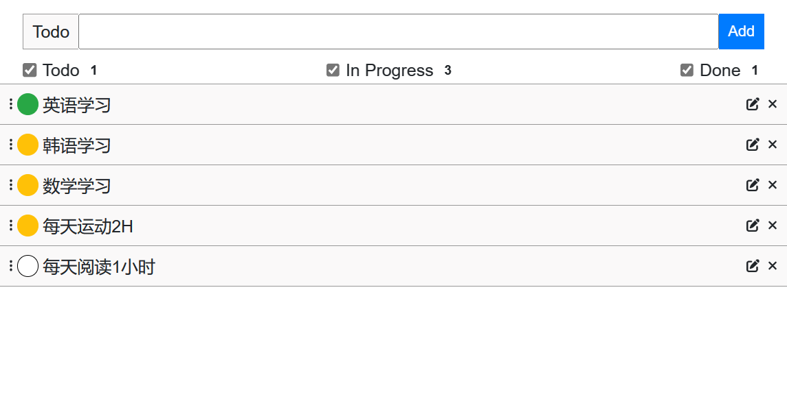

# todolist

> 一款基于Vue2.0持久画的新手入门待办事项Demo

## Build Setup

### 功能描述
- 添加待办事项
- 筛选待办事项
- 修改待办事项
- 编辑待办事项
- 删除待办事项
- 持久化

### 效果
[]()


``` bash
# serve with hot reload at localhost:8080
npm run dev

```


